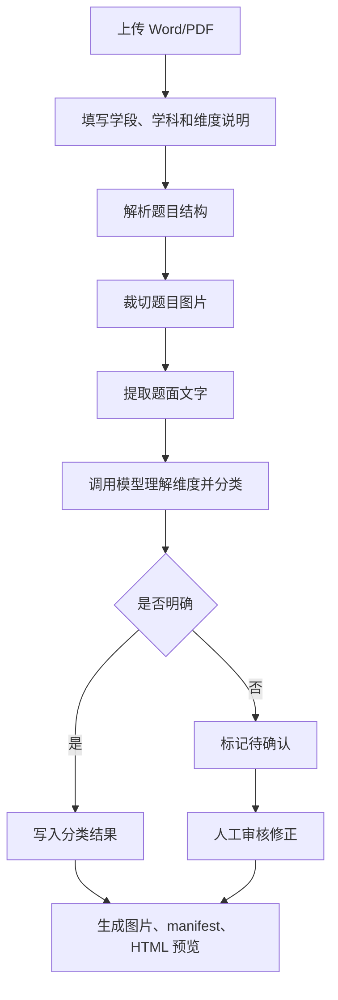

## 1. 产品概述
模型理解题库截取网页工具用于把 Word/PDF 题库按题目裁切成图片，并基于用户每次输入的维度说明调用模型完成题型、题目类型、知识点等结构化分类。
- 解决现有 PowerShell 截取工具依赖固定学科规则、跨学科泛化差的问题。
- 面向 VLM 教育评测集建设场景，目标是降低手动标注和反复改规则的成本。

## 2. 核心功能

### 2.1 用户角色
| 角色 | 使用方式 | 核心权限 |
|------|----------|----------|
| 数据处理人员 | 本地网页打开 | 上传题库文件、输入维度、启动处理、查看和导出结果 |

### 2.2 功能模块
1. **任务创建页**：上传 Word/PDF，填写学段、学科、维度说明、模型配置。
2. **处理监控页**：展示截题进度、模型分类进度、失败项和待确认项。
3. **结果审核页**：预览每道题图片、查看模型给出的维度结果、手动修正存疑项。
4. **导出结果页**：生成 image 图片目录、manifest 表格、历史 HTML 预览和任务配置。

### 2.3 页面详情
| 页面名称 | 模块名称 | 功能描述 |
|----------|----------|----------|
| 任务创建页 | 文件上传 | 支持选择 Word/PDF 文件，优先支持 docx，后续扩展 PDF 页面级裁切 |
| 任务创建页 | 维度输入 | 用户粘贴本批次维度说明，工具不要求提前写死学科规则 |
| 任务创建页 | 模型配置 | 填写模型接口地址、模型名、API Key；支持仅本地规则试跑 |
| 任务创建页 | 输出设置 | 默认输出到 `Documents/题库分类结果`，按学段/学科/任务时间分目录 |
| 处理监控页 | 阶段进度 | 展示解析文件、截题、图片生成、模型判断、导出五个阶段 |
| 处理监控页 | 日志面板 | 实时显示错误原因，避免只弹出“截取失败” |
| 结果审核页 | 图片预览 | 每题显示裁切图片、题号、是否带图、原始题面文本 |
| 结果审核页 | 模型结果 | 展示题型、题目类型、知识点、置信度、存疑原因 |
| 结果审核页 | 人工修正 | 对模型不确定或错误结果进行手动修改 |
| 导出结果页 | 文件导出 | 输出 PNG、CSV、JSON、HTML 预览，历史 HTML 不覆盖 |

## 3. 核心流程
用户创建任务后，系统先解析源文件并裁切题目图片，再将题图、题面文字和本批次维度说明发送给模型，模型返回结构化分类结果。低置信度或无法判断的题目统一标记为 `待确认`，由用户在结果审核页修正后导出。

## 4. 用户界面设计

### 4.1 设计风格
- 设计方向：本地工作台风格，偏专业、克制、信息密度高。
- 主色：墨蓝黑 `#111827`，辅助色：纸张白 `#F8F5EF`，强调色：数据绿 `#21A67A`。
- 按钮：圆角矩形，主操作高对比，危险/失败状态使用橙红色。
- 字体：中文优先使用 Microsoft YaHei，代码和日志使用 Consolas。
- 布局：桌面优先，左侧任务配置，右侧处理状态和结果预览。

### 4.2 页面设计概览
| 页面名称 | 模块名称 | UI 元素 |
|----------|----------|---------|
| 任务创建页 | 文件与维度配置 | 卡片表单、拖拽上传区、多行维度输入框、模型配置折叠面板 |
| 处理监控页 | 进度与日志 | 阶段时间线、进度条、实时日志、失败项列表 |
| 结果审核页 | 题图审核 | 左侧缩略图列表、右侧大图预览、结构化字段编辑器 |
| 导出结果页 | 结果汇总 | 导出路径、文件计数、打开目录按钮、历史预览入口 |

### 4.3 响应式
桌面优先，适配常见 1366px 以上屏幕；小屏幕下改为单列布局，保留上传、任务状态和结果查看核心功能。

## 5. 关键约束
- 不允许模型强行猜测模糊维度；低置信度结果必须标记 `待确认`。
- 图片顶部必须尽量从题目或材料开始，不能从上一题选项开始。
- 历史 HTML 预览必须保留，不被下一批任务覆盖。
- 所有输出默认保存到本机 `Documents/题库分类结果`。
- API Key 只保存在本地配置，不写入导出的结果包。
