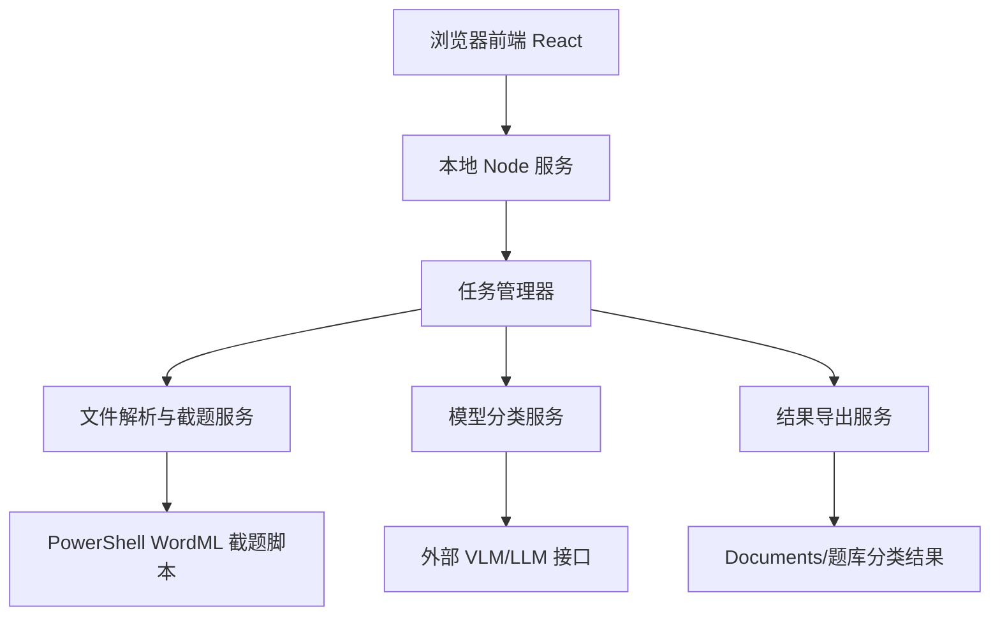
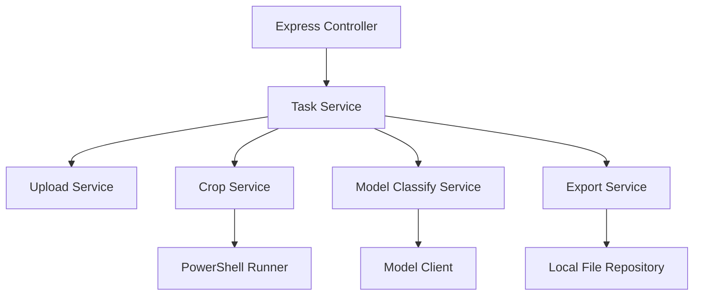
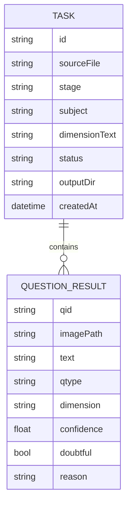

## 1. 架构设计
系统采用本地 Web 应用架构：前端提供任务配置、进度监控和结果审核；本地 Node 服务负责文件上传、调用现有截题脚本、管理任务状态、调用模型接口和导出结果。



## 2. 技术说明
- 前端：React 18 + Vite + TypeScript + Tailwind CSS。
- 后端：Node.js + Express，本地监听 `localhost`，不默认暴露公网。
- 文件上传：`multer` 接收 docx/pdf，写入本地任务临时目录。
- 截题执行：第一阶段复用现有 PowerShell WordML 截题脚本；后续再扩展 PDF 页面级裁切。
- 模型调用：采用 OpenAI-compatible Chat Completions 风格接口，支持传入文本和图片 URL/base64；具体模型地址由用户配置。
- 数据持久化：任务级 JSON 文件，不引入数据库，降低部署复杂度。
- 导出格式：PNG 图片、`manifest_简化维度.csv`、`manifest.json`、`gallery.html`、`gallery_时间戳.html`。

## 3. 路由定义
| 路由 | 用途 |
|------|------|
| `/` | 任务创建和处理入口 |
| `/tasks/:taskId` | 当前任务处理状态 |
| `/tasks/:taskId/review` | 结果审核与人工修正 |
| `/tasks/:taskId/export` | 导出结果与打开输出目录 |

## 4. API 定义

### 4.1 创建任务
```ts
type CreateTaskRequest = {
  file: File
  stage: string
  subject: string
  dimensionText: string
  outputRoot?: string
  onlyImageQuestions: boolean
  modelConfig: {
    provider: "openai-compatible" | "disabled"
    baseUrl?: string
    apiKey?: string
    model?: string
    useVision: boolean
  }
}

type CreateTaskResponse = {
  taskId: string
  status: "queued"
}
```

### 4.2 查询任务状态
```ts
type TaskStatusResponse = {
  taskId: string
  status: "queued" | "running" | "review_required" | "done" | "failed"
  phase: "upload" | "crop" | "classify" | "export"
  progress: number
  message: string
  logs: string[]
}
```

### 4.3 获取题目结果
```ts
type QuestionResult = {
  qid: string
  imagePath: string
  text: string
  stage: string
  subject: string
  qtype: string
  dimension: string
  confidence: number
  doubtful: boolean
  reason: string
}

type TaskResultsResponse = {
  taskId: string
  results: QuestionResult[]
}
```

### 4.4 更新人工修正
```ts
type UpdateQuestionRequest = {
  qid: string
  qtype: string
  dimension: string
  doubtful: boolean
  reason?: string
}
```

## 5. 服务端架构


## 6. 数据模型

### 6.1 数据模型定义


### 6.2 本地文件结构
```text
Documents/题库分类结果/
  高中/
    数学/
      task_20260624_103000/
        source/
        image/
        html/
        media/
        manifest.json
        manifest_简化维度.csv
        gallery.html
        gallery_20260624_103000.html
        task.config.json
```

## 7. 模型分类策略
- 系统提示词要求模型只在维度说明范围内选择，不允许自造维度。
- 输入包含：题面文字、题图、学段、学科、用户维度说明、输出 JSON Schema。
- 输出必须包含：题型、维度、置信度、存疑状态、理由。
- 当模型置信度低于阈值，或维度不在候选范围内，服务端强制改为 `待确认`。
- 模型不可用时，系统仍可完成截题和本地导出，但分类字段标记 `待确认`。

## 8. 安全与本地化
- 默认仅监听 `127.0.0.1`。
- API Key 保存在本地 `config.local.json`，不进入任务导出目录。
- 上传文件和生成图片只保存在本机。
- 删除任务仅删除任务临时目录，不影响历史导出目录。
